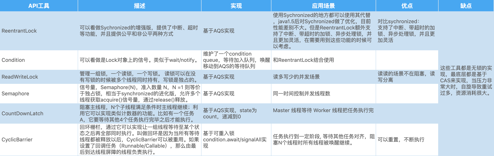
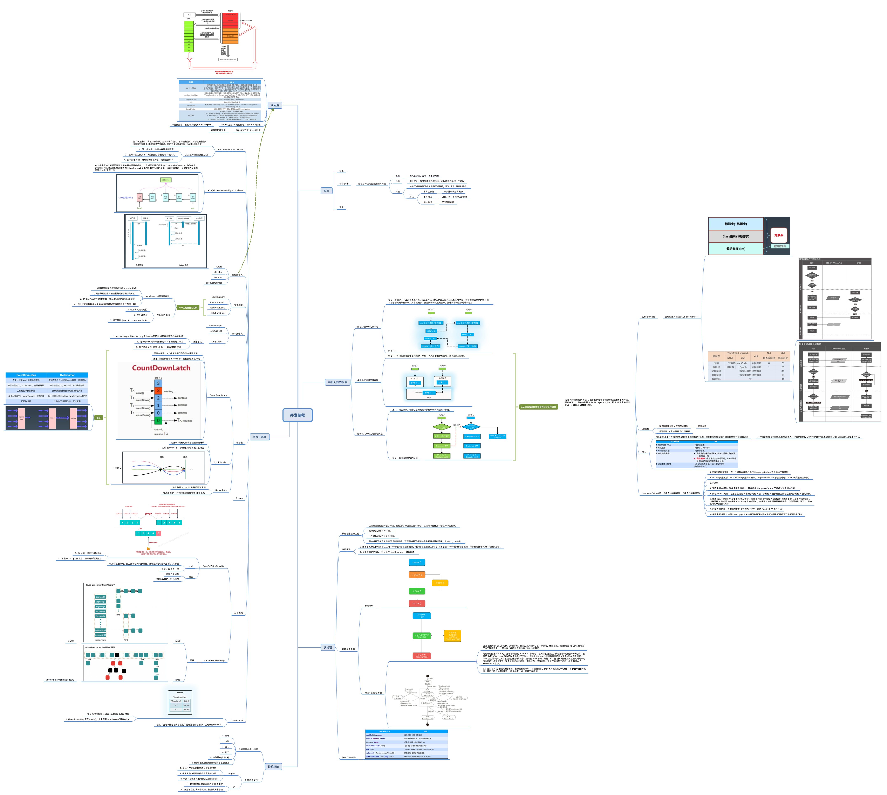

## 第七节课作业
### 1、(选做)把示例代码，运行一遍，思考课上相关的问题。也可以做一些比较。 
详细见第八节课作业的第4题的总结。
### 2、(必做)思考有多少种方式，在main函数启动一个新线程，运行一个方法，拿到这个方法的返回值后，退出主线程?

详细见[文件](./src/main/java/io/github/brightloong/conc/)，总共列举了16种。
## 第八节课作业
### 1、(选做)列举常用的并发操作 API 和工具类，简单分析其使用场景和优缺点。

### 2、(选做)请思考:什么是并发?什么是高并发?实现高并发高可用系统需要考虑哪些因素，对于这些你是怎么理解的?
并发：多个线程同时竞争**相同的资源**。

高并发：站在服务器的角度来看，是服务器能同时处理大量的请求。

实现高并发高可用系统需要考虑哪些因素：

- 并发下的线程安全性
- 容灾机制，集群部署、熔断
- 完备的数据、系统监控以及预警
- 流量控制，网关
- 可扩展
- 网络

### 3、(选做)请思考:还有哪些跟并发类似/有关的场景和问题，有哪些可以借鉴的解决办法。
 
最常见的去餐馆吃饭，多个顾客同时就餐，就是典型的并发场景，如何正确并且快速的服务顾客，类同在编程中对于并发问题，我们如何同时兼顾性能和安全问题。
下面是几个我能想到的解决并发的点。

#### 1. 等待/唤醒

点餐的时候，我们入座等待点餐员过来点餐，类似于线程中的等待唤醒机制。

#### 2 细化锁粒度

从顾客点餐到出餐，这个过程中，每个阶段所竞争的资源不同，点餐时候的点餐员，做餐时候的厨师，细化竞争资源，减少串行量，提高性能。

#### 3. 生产者消费者模型

当后厨准备好菜品后，有可能同时准备好多份，这个时候就把菜品放到指定的地方，服务员会来取餐送到顾客面前，这是典型的生产者消费者模型。我们在并发编程中也可以用到。甚至用MQ，消息队列的方式来进行处理，其实也是一种生产者消费者模型。
### 4、(必做)把多线程和并发相关知识带你梳理一遍，画一个脑图，截图上传到 Github 上。
