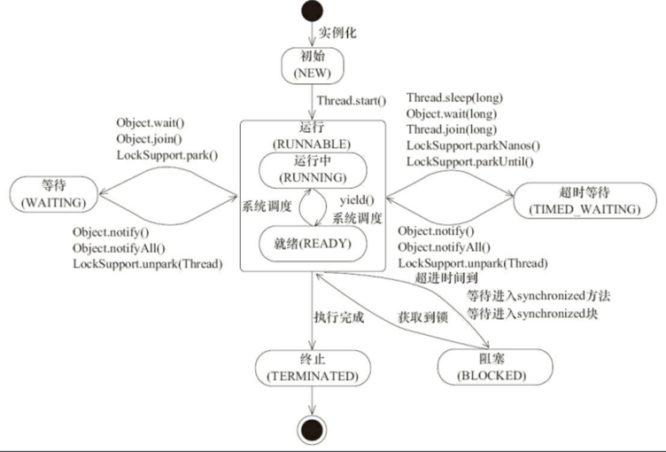

## 第七节课作业
### 1、(选做)把示例代码，运行一遍，思考课上相关的问题。也可以做一些比较。 
详细见第八节课作业的第4题。
### 2、(必做)思考有多少种方式，在main函数启动一个新线程，运行一个方法，拿到这个方法的返回值后，退出主线程?

详细见[文件](./src/main/java/io/github/brightloong/conc/)。
## 第八节课作业
### 1、(选做)列举常用的并发操作 API 和工具类，简单分析其使用场景和优缺点。
详细见第八节课作业的第4题。
### 2、(选做)请思考:什么是并发?什么是高并发?实现高并发高可用系统需要考虑哪些因素，对于这些你是怎么理解的?
并发：多个线程同时竞争**相同的资源**。

高并发：站在服务器的角度来看，是服务器能同时处理大量的请求。

实现高并发高可用系统需要考虑哪些因素：

- 并发下的线程安全性
- 容灾机制，集群部署、熔断
- 完备的数据、系统监控以及预警
- 流量控制，网关
- 可扩展
- 网络

### 3、(选做)请思考:还有哪些跟并发类似/有关的场景和问题，有哪些可以借鉴的解决办法。
 
最常见的去餐馆吃饭，多个顾客同时就餐，就是典型的并发场景，如何正确并且快速的服务顾客，类同在编程中对于并发问题，我们如何同时兼顾性能和安全问题。
下面是几个我能想到的解决并发的点。

#### 1. 等待/唤醒

点餐的时候，我们入座等待点餐员过来点餐，类似于线程中的等待唤醒机制。

#### 2 细化锁粒度

从顾客点餐到出餐，这个过程中，每个阶段所竞争的资源不同，点餐时候的点餐员，做餐时候的厨师，细化竞争资源，减少串行量，提高性能。

#### 3. 生产者消费者模型

当后厨准备好菜品后，有可能同时准备好多份，这个时候就把菜品放到指定的地方，服务员会来取餐送到顾客面前，这是典型的生产者消费者模型。我们在并发编程中也可以用到。甚至用MQ，消息队列的方式来进行处理，其实也是一种生产者消费者模型。
### 4、(必做)把多线程和并发相关知识带你梳理一遍，画一个脑图，截图上传到 Github 上。

### 多线程
#### 1.线程与进程的区别是什么？
进程是资源分配的最小单位，线程是CPU调度的最小单位。进程可以看做是一个执行中的程序。

- 线程是在进程下进行的。
- 一个进程可以包含多个线程。
- 同一进程下多个线程间可以共享数据，而不同进程间共享数据需要通过其他手段，比如MQ，文件等。

#### 2.守护线程
只要当前JVM实例中尚存在任何一个非守护线程没有结束，守护线程就全部工作；只有当最后一个非守护线程结束时，守护线程随着JVM一同结束工作。
默认都是**非守护线程**，可以通过 `setDaemon()` 进行修改。
#### 3. 线程生命周期

##### RUNNABLE 与 BLOCKED 的状态转换

只有一种场景会触发这种转换，就是线程等待 synchronized 的隐式锁。当等待的线程获得 synchronized 隐式锁时，就又会从 BLOCKED 转换到 RUNNABLE 状态。

##### RUNNABLE 与 WAITING 的状态转换
- Object.wait(),背唤醒的时候会转为RUNNABLE
- Thread.join(),thread线程执行完成后，等待它的线程会转为RUNNABLE
- LockSupport.park(),LockSupport.unpark(Thread thread) 可唤醒目标线程，目标线程的状态又会从 WAITING 状态转换到 RUNNABLE。

##### RUNNABLE 与 TIMED_WAITING 的状态转换
- 调用带超时参数的 Thread.sleep(long millis) 方法；
- 调用带超时参数的 Object.wait(long timeout) 方法；
- 调用带超时参数的 Thread.join(long millis) 方法； 
- 调用带超时参数的 LockSupport.parkNanos(Object blocker, long deadline) 方法；
- 调用带超时参数的 LockSupport.parkUntil(long deadline) 方法

##### 从 NEW 到 RUNNABLE 状态
Java 刚创建出来的 Thread 对象就是 NEW 状态

##### 从 RUNNABLE 到 TERMINATED 状态
线程执行完 run() 方法后，会自动转换到 TERMINATED 状态，当然如果执行 run() 方法的时候异常抛出，也会导致线程终止。

#### 4. 线程中断
##### 异常机制
当线程 A 处于 WAITING、TIMED_WAITING 状态时，如果其他线程调用线程 A 的 interrupt() 方法，会使线程 A 返回到 RUNNABLE 状态，同时线程 A 的代码会触发 InterruptedException 异常。上面我们提到转换到 WAITING、TIMED_WAITING 状态的触发条件，都是调用了类似 wait()、join()、sleep() 这样的方法，我们看这些方法的签名，发现都会 throws InterruptedException 这个异常。这个异常的触发条件就是：其他线程调用了该线程的 interrupt() 方法。
##### 主动检测
如果其他线程调用线程 A 的 interrupt() 方法，那么线程 A 可以通过 isInterrupted() 方法，检测是不是自己被中断了，从而退出线程。

#### 5. Thread类

