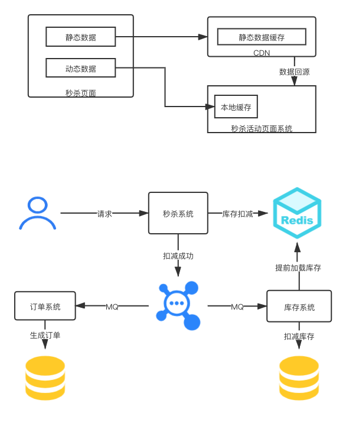

### 1、(必做)针对课上讲解的内容，自己动手设计一个高并发的秒杀系统，讲架构图， 设计文档等，提交到github。

#### 一. 秒杀开始前

思考： 秒杀开始前，对于秒杀页面，用户肯定会频繁刷新页面，需要减少请求到达服务器和数据库

解决：页面数据进行动静态分离，静态数据走CDN，动态数据从服务器获取，为了减少到达数据库，可做本地缓存。

#### 二. 秒杀进行中

##### 2.1 网关

思考：秒杀进行时候，瞬间流量暴增，如果没有较好的预估流量，完全有可能会出现系统全线崩溃的情况。

解决：利用网关，除了能做负载均衡，也可以进行限流，防止突增的流量搞垮系统；除此之外，当系统出现崩溃的时候，可以用网关进行熔断操作，直接返回结果。

##### 2.2 库存缓存

思考：秒杀场景下，瞬间会有大量流量请求库存，如果直接把大量流量直接打到数据库，显而易见，这是行不通的。

解决：将库存加载到内存缓存中，比如可以利用Redis（视情况而定，也可以将库存进行分割，比如一共100个秒杀名额，10台机器，每台操作10个名额的方式）进行缓存，
因为redis天然就是单线程的，所以利用lua脚本可以比较简单的控制库存扣减。

##### 2.3 消息队列

思考：因为是秒杀的业务，用户更关心的是有没有拿到秒杀资格，所以只要库存扣减成功就可以返回给用户抢购成功。

解决：使用消息队列的方式来最后生成订单。

### 简单的架构图

