## 学习总结
### 一. JVM
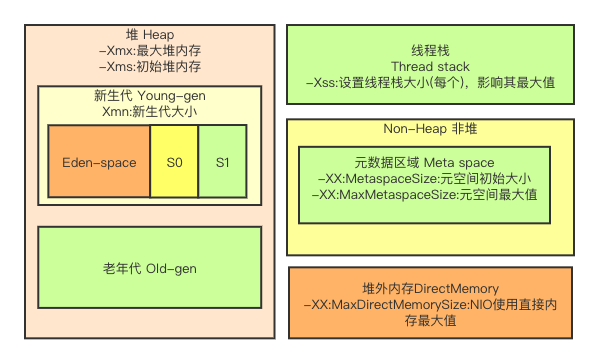

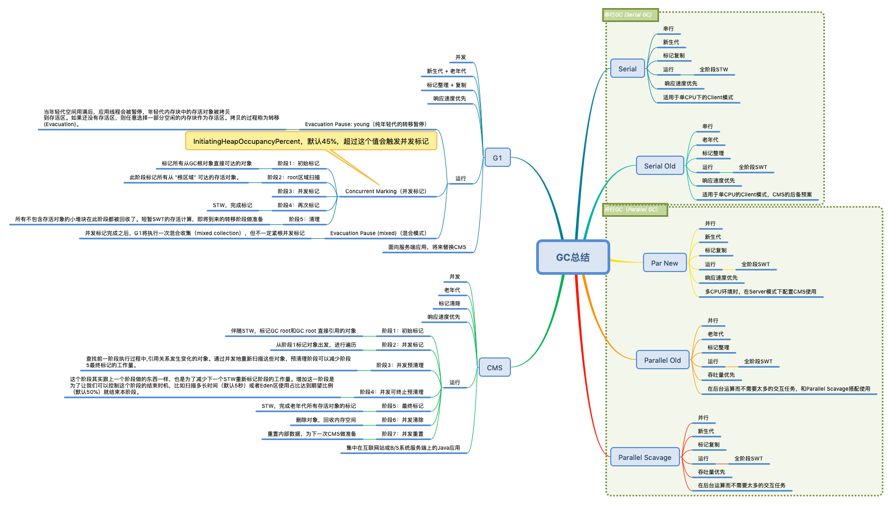

### 二. NIO

#### 2.1 5种IO模型

- 同步异步 是通信模式。
- 阻塞、非阻塞 是 线程处理模式。

### 三. 并发编程 

看图说话

### 四. Spring和ORM等框架

#### 4.1 Spring
##### 4.1.1 常用模块
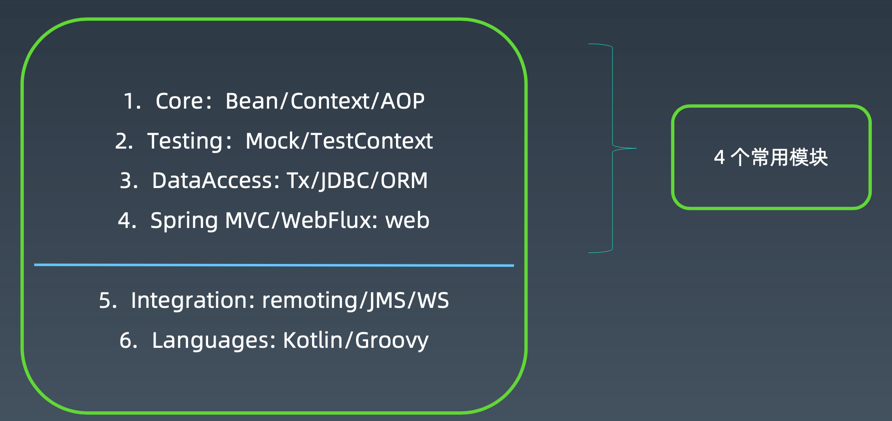
##### 4.1.2 IOC

控制反转，将Bean交给Spring管理，提供依赖查找和依赖注入的功能。

##### 4.1.3 AOP

面向切面编程，通过动态代理或者字节码增强的方式

##### 4.1.4 Bean生命周期
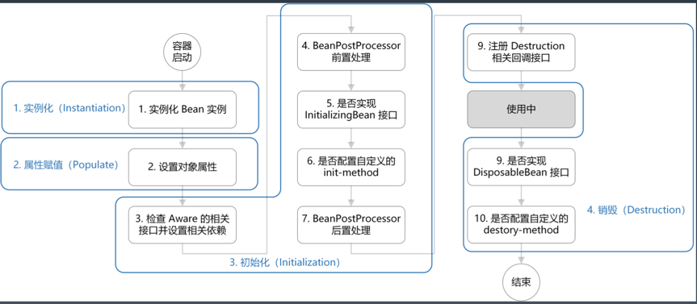

#### 4.2 Spring Boot

##### 4.2.1 自动装配

`@SpringBootApplication`,SpringBoot 应用标注在某个类上说明这个类是 SpringBoot 的主配置类，SpringBoot 就会运行
这个类的 main 方法来启动 SpringBoot 项目。
- @SpringBootConfiguration 
- @EnableAutoConfiguration 
- @AutoConfigurationPackage
- @Import({AutoConfigurationImportSelector.class})

加载所有 META-INF/spring.factories 中存在的配置类。

##### 4.2.2 starter

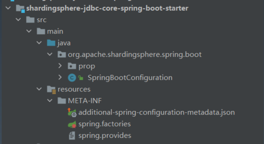

#### 4.3 设计原则

S.O.L.I.D 是面向对象设计和编程(OOD&OOP)中几个重要编码原则(Programming Priciple)的首字
母缩写。

1. SRP:The Single Responsibility Principle 单一责任原则  
2. OCP:The Open Closed Principle 开放封闭原则 
3. LSP:The Liskov Substitution Principle 里氏替换原则 
4. ISP:The Interface Segregation Principle 接口分离原则
5. DIP:The Dependency Inversion Principle 依赖倒置原则

最小知识原则，KISS，高内聚低耦合

#### 4.4 设计模式

GoF 23 个经典设计模式(面向接口编程)。

创建型

1. Factory Method(工厂方法) 2. Abstract Factory(抽象工厂) 3. Builder(建造者)
4. Prototype(原型)
5. Singleton(单例)
   
结构型
6. Adapter(适配器) 
7. Bridge(桥接)
8. Composite(组合) 
9. Decorator(装饰) 
10. Facade(外观) 
11. Flyweight(享元) 
12. Proxy(代理)

行为型

13. Interpreter(解释器)
14. Template Method(模板方法) 
15. Chain of Responsibility(责任链) 
16. Command(命令)
17. Iterator(迭代器)
18. Mediator(中介者)
19. Memento(备忘录)
20. Observer(观察者)
21. State(状态)
22. Strategy(策略)
23. Visitor(访问者)

### 五. MySQL数据库和SQL 

#### 5.1 MySQL执行流程
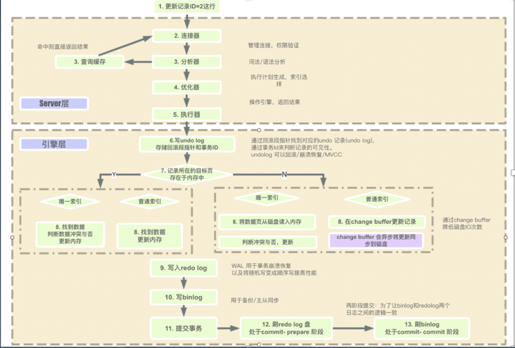

#### 5.2 MySQL执行引擎比较
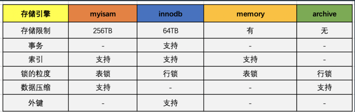

#### 5.3 SQL执行顺序
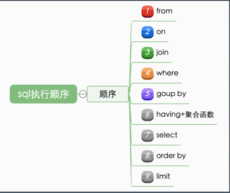

#### 5.4 索引
1. B+树，数据存放在叶子节点上，主键B+树叶子节点上存放的是数据（聚簇索引），非聚簇索引存放的是索引字段+主键
2. 数据按页分块，每页16K，每个节点就是一个页

#### 5.5 参数配置优化
1. 连接参数优化
2. 缓存区优化
3. 配置Innodb优化
#### 5.6 数据库设计优化

- 唯一约束和索引的关系?
- 是否可以冗余字段?
- 是否使用游标、变量、视图、自定义函数、存储过程? - 自增主键的使用问题?
- 能够在线修改表结构(DDL 操作)?
- 逻辑删除还是物理删除?
- 要不要加 create_time,update_time 时间戳?
- 数据库碎片问题?
- 如何快速导入导出、备份数据?

#### 5.7 数据库锁

- 表级锁
- 行级锁
   - 记录锁(Record): 始终锁定索引记录，注意隐藏的聚簇索引;
   - 间隙锁(Gap):
   - 临键锁(Next-Key): 记录锁+间隙锁的组合; 可“锁定”表中不存在记录 •谓词锁(Predicat): 空间索引
#### 5.8 数据库事务

##### 5.8.1 隔离级别
- 读未提交: READ UNCOMMITTED
- 读已提交: READ COMMITTED
- 可重复读: REPEATABLE READ 
- 可串行化: SERIALIZABLE

##### 5.8.2 MVCC
数据表中的一行记录，其实可能有多个版本 (row)，每个版本有自己的 row trx_id，形成如下的版本链：

- 最新版本是 V4，k 的值是 22，它是被 transaction id 为 25 的事务更新的，因此它的 row trx_id 也是 25。 
- 而 V1、V2、V3 并不是物理上真实存在的，而是每次需要的时候根据当前版本和 undo log 计算出来的。

先看图

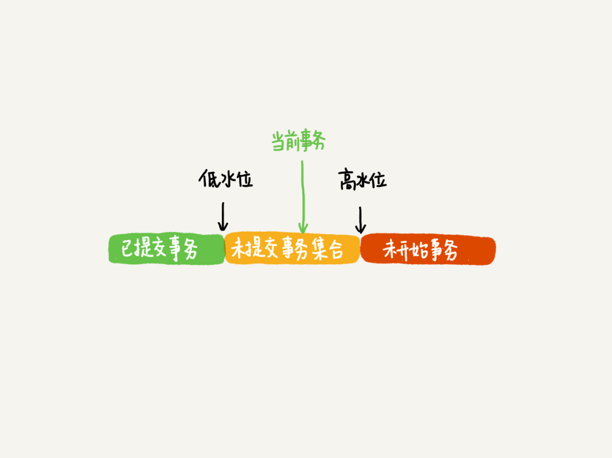

1. InnoDB 为每个事务构造了一个数组，用来保存这个事务启动瞬间，当前正在“活跃”的所有事务 ID
2. 数组里面事务 ID 的最小值记为低水位，当前系统里面已经创建过的事务 ID 的最大值加 1 记为高水位。

> 这个视图数组和高水位，就组成了当前事务的一致性视图（read-view）。

这样，对于当前事务的启动瞬间来说，一个数据版本的 row trx_id，有以下几种可能：
1. 如果落在绿色部分，表示这个版本是已提交的事务或者是当前事务自己生成的，这个数据是可见的；
2. 如果落在红色部分，表示这个版本是由将来启动的事务生成的，是肯定不可见的； 
3. 如果落在黄色部分，那就包括两种情况
   - a. 若 row trx_id 在数组中，表示这个版本是由还没提交的事务生成的，不可见；
   - b. 若 row trx_id 不在数组中，表示这个版本是已经提交了的事务生成的，可见。

#### 5.9 两个日志
- undo log
- redo log

#### 5.10 SQL优化
- 索引失效
- 避免回表
- 最左原则
- 连接查询驱动表选择

#### 5.11 主从复制
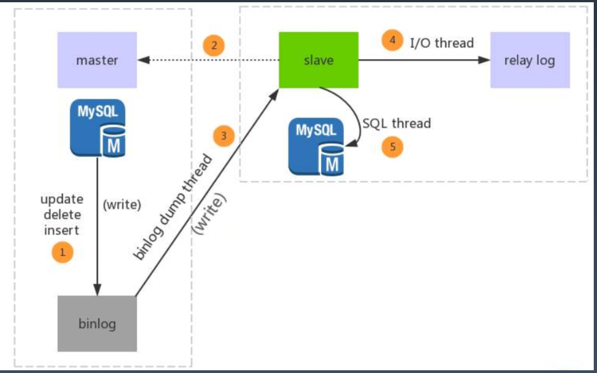

- 异步复制
- 半同步复制
- 组复制（MGR）

#### 5.12 读写分离

#### 5.13 高可用
- 手动切换
- MHA
- MGR
- MySQL Cluster
- Orchestrator
### 六. 分库分表 

#### 6.1 为什么要做数据库拆分

单机数据库无法适应互联网的发展，海量的数据在单机数据库上带来以下的问题：

- 容量
- 性能
- 可用性
- 运维成本（数据备份和恢复的时间成本）

#### 6.2 垂直拆分

垂直拆分(拆库):将一个数据库，拆分成多个提供不同业务数据处理能力的数据库。

垂直拆分(拆表):如果单表数据量过大，还可能需要对单表进行拆分。

#### 6.3 水平拆分

分为：分库、分表、分库分表三类

水平拆分就是直接对数据进行分片，有分库和分表两个具体方 式，但是都只是降低单个节点数据量，但不改变数据本身的结构。

#### 6.4 分布式事务

##### 6.4.1 XA

XA强一致性事务。

##### 6.4.2 BASE柔性事务

##### 6.4.3 TCC

TCC 不依赖 RM 对分布式事务的支持，而是通过对业务逻辑的分解来实现分布式事务。

1. 准备操作 Try:完成所有业务检查，预留必须的业务资源。
2. 确认操作 Confirm:真正执行的业务逻辑，不做任何业务检查，只使用 Try 阶段预留的业务资源 。因此，只要 Try 操作成功，Confirm 必须能成功。另外，Confirm 操作需满足幂等性，保证一 笔分布式事务能且只能成功一次。
3. 取消操作 Cancel:释放 Try 阶段预留的业务资源。同样的，Cancel 操作也需要满足幂等性。

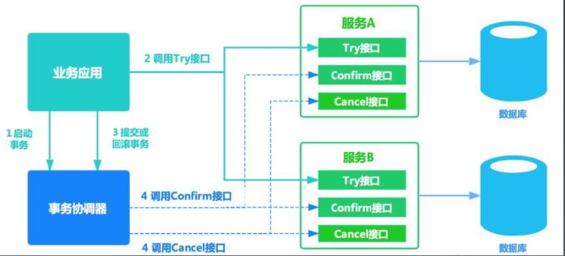

> 不同于AT的是就是需要自行定义各个阶段的逻辑。

##### 6.4.4 AT

AT模式就是两阶段提交，`自动生成反向SQL`。

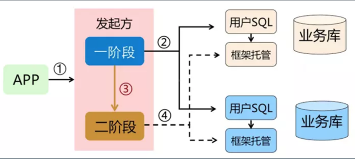

### 七. RPC和微服务 

### 八. 分布式缓存 

#### 8.1 缓存
广义上来说，为了加速数据处理，让业务更快访问的临时存放冗余数据，都是缓存。

狭义上，现在我们一般在分布式系统里把缓存到内存的数据叫做内存缓存

#### 8.2 缓存加载时机

##### 8.2.1 启动全量加载

全局有效，使用简单

##### 8.2.2懒加载 

1. 同步使用加载
    - 先看缓存是否有数据，没有的话从数据库读取
    - 读取的数据，先放到内存，然后返回给调用方
2. 延迟异步加载
    - 从缓存获取数据，不管是否为空直接返回
    - 策略1===>异步:如果为空，则发起一个异步加载的线程，负责加载数据
    - 策略2===>解耦:异步线程负责维护缓存的数据，定期或根据条件触发更新
    
#### 8.3 缓存类型

1. 本地缓存：map实现、Guava Cache、基于Spring Cache的本地缓存
2. 远程缓存：Redis/Memcached 缓存中间件、Hazelcast/Ignite 内存网格

#### 8.4 缓存常见问题
##### 8.4.1 缓存穿透
问题：大量`并发查询不存在的KEY`，导致都直接将压力透传到数据库。

解决办法：
1. 缓存空值的KEY，这样第一次不存在也会被加载会记录，下次拿到有这个KEY。
2. Bloom过滤或RoaringBitmap 判断KEY是否存在。
3. 完全以缓存为准，使用延迟异步加载的策略2，这样就不会触发更新。

##### 8.4.2 缓存击穿
问题:`某个KEY失效`的时候，正好有大量并发请求访问这个KEY。

> 注意区分缓存穿透，穿透是访问不存在的key，击穿是某个key失效

解决办法:

1. KEY的更新操作添加全局互斥锁，防止请求透传到数据库。
2. 完全以缓存为准，使用延迟异步加载的策略2，这样就不会触发更新。

##### 8.4.3 缓存雪崩

问题:当`某一时刻发生大规模的缓存失效`的情况，会有大量的请求进来直接打到数据库，导致数据 库压力过大升值宕机。

分析:一般来说，由于更新策略、或者数据热点、缓存服务宕机等原因，可能会导致缓存数据同一个时间点大规模不可用，或者都更新。所以，需要我们的更新策略要在时间上合适，数据要均匀分散，缓存服务器要多台高可用。

解决办法: 

1. 更新策略在时间上做到比较均匀。
2. 使用的热数据尽量分散到不同的机器上。 
3. 多台机器做主从复制或者多副本，实现高可用。
4. 实现熔断限流机制，对系统进行负载能力控制。

##### 8.4.4 缓存和数据库数据一致性

#### 8.5 Reids

##### 8.5.1 5种基本数据结构
1. 字符串
2. 散列（hash）
3. 列表（list）
4. 集合（set）
5. 有序集合（sorted set）

##### 8.5.2 3种高级数据机构

1. Bitmaps
2. Hyperloglogs
3. GEO

##### 8.5.3 使用场景

1. 业务数据缓存
2. 业务数据处理
3. 全局一致计数
4. 高效统计计数
5. 发布订阅与Stream
6. 分布式锁

##### 8.5.4 高可用
- 主从复制
- Reids Sentinel
- Reids Cluster

### 九. 分布式消息队列

#### 9.1 MQ的作用

- 异步通信:异步通信，减少线程等待，特别是处理批量等大事务、耗时操作。
- 系统解耦:系统不直接调用，降低依赖，特别是不在线也能保持通信最终完成。 
- 削峰平谷:压力大的时候，缓冲部分请求消息，类似于背压处理。
- 可靠通信:提供多种消息模式、服务质量、顺序保障等。

#### 9.2 主流MQ中间件
1. ActiveMQ
2. ActiveMQ
3. RocketMQ
4. kafka
    - 分区
    - 副本
    - rebalance